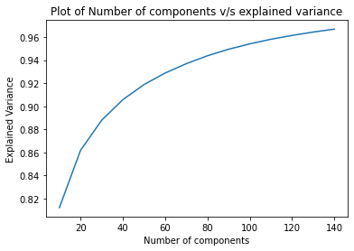

### 載入所需的Libraries


```python
import re
import warnings
warnings.filterwarnings("ignore")
import pandas as pd
import numpy as np
import matplotlib.pyplot as plt
from sklearn.model_selection import train_test_split
from sklearn.feature_extraction.text import TfidfVectorizer
from sklearn.decomposition import TruncatedSVD
from typing import List
import string
```

### 載入資料


```python
# read data from spam.csv

###<your code>###
with open("spam.csv",'r',errors="ignore") as f:
    sms_data = pd.read_csv(f,header=0).iloc[:,:2]
    sms_data.rename(columns={'v1':'label','v2':'content'},inplace=True)
print(sms_data.shape)
sms_data.head()
```

    (5572, 2)


<div>
<style scoped>
    .dataframe tbody tr th:only-of-type {
        vertical-align: middle;
    }

    .dataframe tbody tr th {
        vertical-align: top;
    }

    .dataframe thead th {
        text-align: right;
    }
</style>
<table border="1" class="dataframe">
  <thead>
    <tr style="text-align: right;">
      <th></th>
      <th>label</th>
      <th>content</th>
    </tr>
  </thead>
  <tbody>
    <tr>
      <th>0</th>
      <td>ham</td>
      <td>Go until jurong point, crazy.. Available only ...</td>
    </tr>
    <tr>
      <th>1</th>
      <td>ham</td>
      <td>Ok lar... Joking wif u oni...</td>
    </tr>
    <tr>
      <th>2</th>
      <td>spam</td>
      <td>Free entry in 2 a wkly comp to win FA Cup fina...</td>
    </tr>
    <tr>
      <th>3</th>
      <td>ham</td>
      <td>U dun say so early hor... U c already then say...</td>
    </tr>
    <tr>
      <th>4</th>
      <td>ham</td>
      <td>Nah I don't think he goes to usf, he lives aro...</td>
    </tr>
  </tbody>
</table>
</div>


```python
# check how many spams and hams
###<your code>###
sms_data.groupby('label').count()
```


<div>
<style scoped>
    .dataframe tbody tr th:only-of-type {
        vertical-align: middle;
    }

    .dataframe tbody tr th {
        vertical-align: top;
    }

    .dataframe thead th {
        text-align: right;
    }
</style>
<table border="1" class="dataframe">
  <thead>
    <tr style="text-align: right;">
      <th></th>
      <th>content</th>
    </tr>
    <tr>
      <th>label</th>
      <th></th>
    </tr>
  </thead>
  <tbody>
    <tr>
      <th>ham</th>
      <td>4825</td>
    </tr>
    <tr>
      <th>spam</th>
      <td>747</td>
    </tr>
  </tbody>
</table>
</div>


```python
# change label to from string to number
# "ham" --> 0, "spam" --> 1
sms_data['label'] = (sms_data['label']=='spam').astype(int)
###<your code>###
sms_data.head()
```


<div>
<style scoped>
    .dataframe tbody tr th:only-of-type {
        vertical-align: middle;
    }

    .dataframe tbody tr th {
        vertical-align: top;
    }

    .dataframe thead th {
        text-align: right;
    }
</style>
<table border="1" class="dataframe">
  <thead>
    <tr style="text-align: right;">
      <th></th>
      <th>label</th>
      <th>content</th>
    </tr>
  </thead>
  <tbody>
    <tr>
      <th>0</th>
      <td>0</td>
      <td>Go until jurong point, crazy.. Available only ...</td>
    </tr>
    <tr>
      <th>1</th>
      <td>0</td>
      <td>Ok lar... Joking wif u oni...</td>
    </tr>
    <tr>
      <th>2</th>
      <td>1</td>
      <td>Free entry in 2 a wkly comp to win FA Cup fina...</td>
    </tr>
    <tr>
      <th>3</th>
      <td>0</td>
      <td>U dun say so early hor... U c already then say...</td>
    </tr>
    <tr>
      <th>4</th>
      <td>0</td>
      <td>Nah I don't think he goes to usf, he lives aro...</td>
    </tr>
  </tbody>
</table>
</div>


### 切分資料
將資料依據label比例切分為training data與testing data


```python
###<your code>###
X_train, X_test, y_train, y_test = train_test_split(
    np.arange(len(sms_data)), sms_data['label'], test_size=0.2, random_state=42)
sms_train = sms_data.iloc[X_train]
sms_test = sms_data.iloc[X_test]
print(sms_train.groupby("label").count())
print(sms_test.groupby("label").count())

```

           content
    label         
    0         3860
    1          597
           content
    label         
    0          965
    1          150


### 資料預處理
* 將所有字詞轉為小寫
* 移除所有數字、標點符號


```python
def preprocess(df: pd.DataFrame) -> pd.DataFrame:
    
    for i in range(len(df)):
        # make all content to lowercase
        ###<your code>###
        sentence = df.iloc[i,1].lower()
        
        # remove all punctuations
        ###<your code>###
        pattern = r'[a-zA-Z]+'
        sentence = re.findall(pattern, sentence)
        df.iloc[i,1] = " ".join(sentence)
    return df

processed_train = preprocess(sms_train)
processed_test = preprocess(sms_test)

print("Train:")
print(processed_train.head())
print("Test:")
print(processed_test.head())


```

    Train:
          label                                            content
    1978      0  no i m in the same boat still here at my moms ...
    3989      1  bank of granite issues strong buy explosive pi...
    3935      0      they r giving a second chance to rahul dengra
    4078      0            o i played smash bros lt gt religiously
    4086      1  private your account statement for shows un re...
    Test:
          label                                            content
    3245      0  funny fact nobody teaches volcanoes erupt tsun...
    944       0  i sent my scores to sophas and i had to do sec...
    1044      1  we know someone who you know that fancies you ...
    2484      0  only if you promise your getting out as soon a...
    812       1  congratulations ur awarded either of cd gift v...


```python

```


```python
# split data into x_train, y_train, x_test, y_test
y_train, x_train = zip(*processed_train.values)
y_test, x_test = zip(*processed_test.values)

# check numbers of unique word in the corpus
len(set(" ".join(list(x_train + x_test)).split()))
```


    7708


### TF-IDF
可以發現種共有7708個字詞，這裡使用TF-IDF將來選取最高分的前2000個字詞
(若忘記的學員可參考先前TF-IDF課程章節或[此篇教學](https://ithelp.ithome.com.tw/articles/10228815?sc=iThelpR))


```python
###<your code>###
vectorizer = TfidfVectorizer(max_features=2000)
vectorizer.fit(list(x_train + x_test))
tfidf_train = vectorizer.transform(x_train)
tfidf_test= vectorizer.transform(x_test)
print(f"Number of unique word: {len(vectorizer.vocabulary_)}")
(tfidf_train, tfidf_test)
```

    Number of unique word: 2000


    (<4457x2000 sparse matrix of type '<class 'numpy.float64'>'
     	with 50806 stored elements in Compressed Sparse Row format>,
     <1115x2000 sparse matrix of type '<class 'numpy.float64'>'
     	with 12832 stored elements in Compressed Sparse Row format>)


### 建立共現矩陣


```python
def create_co_matrix(corpus: List[str], vocab_list: List[str], word2idx: dict,
                     window_size: int=1, use_weighting: bool=False, verbose: bool=False) -> np.ndarray:
    '''Function to create co-occurrence matrix
    '''
    #initialize co-occurrence matrix
    ###<your code>###
    vocab_size = len(vocab_list)
    co_matrix = np.zeros(shape=(vocab_size, vocab_size), dtype=np.int32)
    
    for idx, sms in enumerate(corpus):
        ###<your code>###
        sms = sms.split(" ")
        sentence_size = len(sms)
        for center_i, center_word_id in enumerate(sms):
            ###<your code>###
            left_idx = center_i - window_size if center_i - window_size >= 0 else 0
            context_ids = sms[left_idx:center_i]
            
            for left_i, left_word_id in enumerate(context_ids):
                ###<your code>###
                if left_word_id not in vocab_list or center_word_id not in vocab_list:
                    continue
                co_matrix[word2idx[center_word_id], word2idx[left_word_id]] += 1
                co_matrix[word2idx[left_word_id], word2idx[center_word_id]] += 1
        if verbose:
            if idx != 0 and idx%500 == 0:
                    print(f"finishing {idx+1}/{len(corpus)}")
    print("Done")
    if use_weighting:
        # if use weighting, then we set the co-occurrence with the word itself to 1.0
        ###<your code>###
        np.fill_diagonal(co_matrix, 1.)
        
    return co_matrix

co_matrix = create_co_matrix(x_train, vectorizer.get_feature_names(), vectorizer.vocabulary_,
                             window_size=3, use_weighting=True, verbose=True)

co_matrix
```

    finishing 501/4457
    finishing 1001/4457
    finishing 1501/4457
    finishing 2001/4457
    finishing 2501/4457
    finishing 3001/4457
    finishing 3501/4457
    finishing 4001/4457
    Done


    array([[1, 0, 0, ..., 0, 0, 0],
           [0, 1, 0, ..., 0, 0, 0],
           [0, 0, 1, ..., 0, 0, 0],
           ...,
           [0, 0, 0, ..., 1, 0, 0],
           [0, 0, 0, ..., 0, 1, 0],
           [0, 0, 0, ..., 0, 0, 1]], dtype=int32)


### 建立PPMI矩陣


```python
#定義正向點間互資訊

def ppmi(co_matrix: np.ndarray, eps: float=1e-8, verbose: bool=False):
    ###<your code>###
    M = np.zeros_like(co_matrix, dtype=np.float32)
    N = np.sum(co_matrix)
    S = np.sum(co_matrix, axis=0)
    total = co_matrix.shape[0]*co_matrix.shape[1]

    cnt = 0
    for i in range(co_matrix.shape[0]):
        for j in range(co_matrix.shape[1]):
            pmi = np.log2(co_matrix[i, j]*N / (S[i]*S[j] + eps))
            M[i, j] = max(0, pmi)
            
            if verbose:
                cnt += 1
                if cnt % 10 == 0 or cnt == total:
                    print(f"{cnt}/{total} Done")
    
    return M

ppmi_matrix = ppmi(co_matrix, verbose=False)
ppmi_matrix
```


    array([[11.511069 ,  0.       ,  0.       , ...,  0.       ,  0.       ,
             0.       ],
           [ 0.       ,  9.511069 ,  0.       , ...,  0.       ,  0.       ,
             0.       ],
           [ 0.       ,  0.       ,  4.1599393, ...,  0.       ,  0.       ,
             0.       ],
           ...,
           [ 0.       ,  0.       ,  0.       , ...,  9.85092  ,  0.       ,
             0.       ],
           [ 0.       ,  0.       ,  0.       , ...,  0.       ,  5.317346 ,
             0.       ],
           [ 0.       ,  0.       ,  0.       , ...,  0.       ,  0.       ,
             8.23621  ]], dtype=float32)


### 使用SVD降維
利用sklearn中的TruncatedSVD對co-occurrence matrix進行降維，並利用variance來找出最適合的維度
[參考文獻](https://medium.com/swlh/truncated-singular-value-decomposition-svd-using-amazon-food-reviews-891d97af5d8d)

(讀者可以嘗試使用SVD對PPMI進行降維)


```python
# Program to find the optimal number of components for Truncated SVD
n_comp = range(10,150,10) # list containing different values of components
variance_sum = [] # explained variance ratio for each component of Truncated SVD

for dim in n_comp:
    ###<your code>###
    svd = TruncatedSVD(n_components=dim)
    svd.fit(co_matrix)
    variance_sum.append(svd.explained_variance_ratio_.sum())
    print(f"Number of components = {dim} and explained variance = {svd.explained_variance_ratio_.sum()}")
plt.plot(n_comp, variance_sum)
plt.xlabel('Number of components')
plt.ylabel("Explained Variance")
plt.title("Plot of Number of components v/s explained variance")
plt.show()
```

    Number of components = 10 and explained variance = 0.8122252252211406
    Number of components = 20 and explained variance = 0.8618518278765765
    Number of components = 30 and explained variance = 0.887917534486169
    Number of components = 40 and explained variance = 0.9057075965761119
    Number of components = 50 and explained variance = 0.9187933551808931
    Number of components = 60 and explained variance = 0.9287805472542078
    Number of components = 70 and explained variance = 0.9368714900073191
    Number of components = 80 and explained variance = 0.943738636932488
    Number of components = 90 and explained variance = 0.9493713463678841
    Number of components = 100 and explained variance = 0.9540334631859093
    Number of components = 110 and explained variance = 0.9580177283469209
    Number of components = 120 and explained variance = 0.9613456050772741
    Number of components = 130 and explained variance = 0.9642634733647462
    Number of components = 140 and explained variance = 0.9668263292291237


    

    


```python
# choose 140 as final dimension to reduce to 
# 利用上述找到的最適合dimension來對co-occurrence matrix進行降維
###<your code>###
svd = TruncatedSVD(n_components=140)
svd.fit(co_matrix)
re_co_matrix = svd.transform(co_matrix)
```

### 使用KNN模型進行分類
在進行分類之前，先利用簡單的詞向量平均來計算文本向量

[參考文獻](https://medium.com/ai-academy-taiwan/nlp-%E4%B8%8D%E5%90%8C%E8%A9%9E%E5%90%91%E9%87%8F%E5%9C%A8%E6%96%87%E6%9C%AC%E5%88%86%E9%A1%9E%E4%B8%8A%E7%9A%84%E8%A1%A8%E7%8F%BE%E8%88%87%E5%AF%A6%E4%BD%9C-e72a2daecfc)


```python
# get doc vector via take mean of all word vectors inside the corresponding document

def make_doc_vectors(corpus: List[str], word2idx: dict, vocab_list: List) -> List[np.ndarray]:
    
    # vectorizing data 
    # and make document vector by take mean to all word vecto
    doc_vec = []
    empty_doc_list = []
    for i, sms_msg in enumerate(corpus):
        sms_msg = [word2idx[word] for word in sms_msg.split() if word in vocab_list] #tokenize
        if len(sms_msg) > 0:
            sms_msg = np.array([re_co_matrix[ids] for ids in sms_msg]) #vectorize
            doc_vec.append(sms_msg.mean(axis=0))
        else:
            empty_doc_list.append(i)
            print(f"document {i} doesn't contain word in vocab_list")
            print(corpus[i])
            print("\n")
        
    return np.vstack(doc_vec), empty_doc_list

word2idx = vectorizer.vocabulary_
vocab_list = vectorizer.get_feature_names()

doc_vec_train, missing_train_list = make_doc_vectors(x_train, word2idx, vocab_list)
print("="*50)
doc_vec_test, missing_test_list = make_doc_vectors(x_test, word2idx, vocab_list)
```

    document 49 doesn't contain word in vocab_list
    k k congratulation
    
    
    document 169 doesn't contain word in vocab_list
    ultimately tor motive tui achieve korli
    
    
    document 343 doesn't contain word in vocab_list
    hanks lotsly
    
    
    document 513 doesn't contain word in vocab_list
    east coast
    
    
    document 1229 doesn't contain word in vocab_list
    raviyog peripherals bhayandar east
    
    
    document 1958 doesn't contain word in vocab_list
    beerage
    
    
    document 2296 doesn't contain word in vocab_list
    audrie lousy autocorrect
    
    
    document 2624 doesn't contain word in vocab_list
    g w r
    
    
    document 2634 doesn't contain word in vocab_list
    erutupalam thandiyachu
    
    
    document 3503 doesn't contain word in vocab_list
    received understood n acted upon
    
    
    document 3568 doesn't contain word in vocab_list
    
    
    
    document 3755 doesn't contain word in vocab_list
    
    
    
    document 4078 doesn't contain word in vocab_list
    u
    
    
    document 4449 doesn't contain word in vocab_list
    garbage bags eggs jam bread hannaford wheat chex
    
    
    ==================================================
    document 225 doesn't contain word in vocab_list
    ringtoneking
    
    
    document 644 doesn't contain word in vocab_list
    
    
    
    document 918 doesn't contain word in vocab_list
    tf p
    
    


```python
from sklearn.neighbors import KNeighborsClassifier

# training
y_train_filter = np.delete(np.array(y_train), missing_train_list)

###<your code>###
knn = KNeighborsClassifier(n_neighbors=5)
knn.fit(doc_vec_train, y_train_filter)
train_pred = knn.predict(doc_vec_train)

# testing
y_test_filter = np.delete(np.array(y_test), missing_test_list)
###<your code>###
test_pred = knn.predict(doc_vec_test)
```


```python
print(f"train acc: {np.sum(train_pred == y_train_filter) / len(y_train_filter)}")
print(f"train acc: {np.sum(test_pred == y_test_filter) / len(y_test_filter)}")
```

    train acc: 0.9691649786180508
    train acc: 0.9523381294964028

