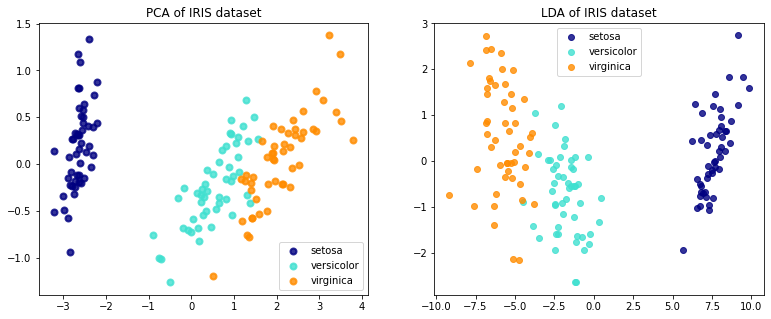

* 思考題：監督式學習與非監督式學習個別的優缺點？
* 本日課程沒有實作練習，推薦學員們可以查看參考資料，經典降維演算法：PCA，儘管 PCA 並不是 NLP 領域必學演算法，然而相當的常見，應用領域也很廣泛，理解 PCA(非監督學習) 後，有興趣的學員們可以嘗試理解 PCA 與 LDA(監督學習降維演算法) 的差異。

https://scikit-learn.org/stable/auto_examples/decomposition/plot_pca_vs_lda.html#sphx-glr-auto-examples-decomposition-plot-pca-vs-lda-py


```python
import matplotlib.pyplot as plt

from sklearn import datasets
from sklearn.decomposition import PCA
from sklearn.discriminant_analysis import LinearDiscriminantAnalysis

iris = datasets.load_iris()

X = iris.data
y = iris.target
target_names = iris.target_names
X.shape
```


    (150, 4)


```python
pca = PCA(n_components=2)
X_r = pca.fit(X).transform(X)

lda = LinearDiscriminantAnalysis(n_components=2)
X_r2 = lda.fit(X, y).transform(X)
print(X_r.shape)
print(X_r2.shape)
```

    (150, 2)
    (150, 2)


```python
# Percentage of variance explained for each components
print('explained variance ratio (first two components): %s'
      % str(pca.explained_variance_ratio_))
plt.figure(figsize=(13,5))
# PCA
plt.subplot(121)
colors = ['navy', 'turquoise', 'darkorange']
lw = 2

for color, i, target_name in zip(colors, [0, 1, 2], target_names):
    plt.scatter(X_r[y == i, 0], X_r[y == i, 1], color=color, alpha=.8, lw=lw,
                label=target_name)
plt.legend(loc='best', shadow=False, scatterpoints=1)
plt.title('PCA of IRIS dataset')


#LDA
plt.subplot(122)
colors = ['navy', 'turquoise', 'darkorange']
lw = 2

for color, i, target_name in zip(colors, [0, 1, 2], target_names):
    plt.scatter(X_r2[y == i, 0], X_r2[y == i, 1], alpha=.8, color=color,
                label=target_name)
plt.legend(loc='best', shadow=False, scatterpoints=1)
plt.title('LDA of IRIS dataset')

plt.show()
```

    explained variance ratio (first two components): [0.92461872 0.05306648]


    

    


```python

```
