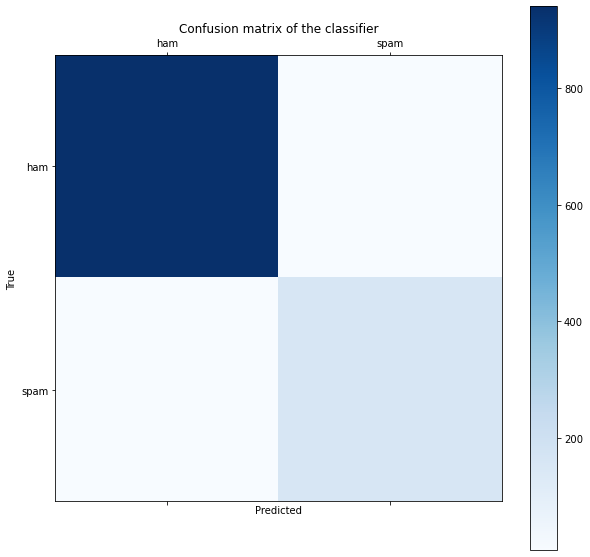

# Naive Bayes

## Importing the libraries


```python
import warnings
warnings.filterwarnings("ignore")
import numpy as np
import matplotlib.pyplot as plt
import pandas as pd
import os
import glob
import codecs
import re
```

## Importing the dataset


```python
dataset = pd.read_csv(r'datasets_483_982_spam.csv', encoding = 'latin-1')
all_data = []

for content,label in dataset[['v2','v1']].values:
    if label == 'spam':
        label = 1
    else :
        label = 0
    all_data.append([content, label])
all_data = np.array(all_data)
```

### 取出訓練內文與標註


```python
X = all_data[:,0]
Y = all_data[:,1].astype(np.uint8)
```


```python
print('Training Data Examples : \n{}'.format(X[:5]))
```

    Training Data Examples : 
    ['Go until jurong point, crazy.. Available only in bugis n great world la e buffet... Cine there got amore wat...'
     'Ok lar... Joking wif u oni...'
     "Free entry in 2 a wkly comp to win FA Cup final tkts 21st May 2005. Text FA to 87121 to receive entry question(std txt rate)T&C's apply 08452810075over18's"
     'U dun say so early hor... U c already then say...'
     "Nah I don't think he goes to usf, he lives around here though"]


```python
print('Labeling Data Examples : \n{}'.format(Y[:5]))
```

    Labeling Data Examples : 
    [0 0 1 0 0]


### 文字預處理


```python
from sklearn.metrics import confusion_matrix
from nltk.corpus import stopwords

import nltk

nltk.download('stopwords',quiet=True)

# Lemmatize with POS Tag
from nltk.corpus import wordnet
from nltk.stem import WordNetLemmatizer 

## 創建Lemmatizer
lemmatizer = WordNetLemmatizer() 
def get_wordnet_pos(word):
    """將pos_tag結果mapping到lemmatizer中pos的格式"""
    tag = nltk.pos_tag([word])[0][1][0].upper()
    tag_dict = {"J": wordnet.ADJ,
                "N": wordnet.NOUN,
                "V": wordnet.VERB,
                "R": wordnet.ADV}

    return tag_dict.get(tag, wordnet.NOUN)


def clean_content(X):
    # remove non-alphabet characters
    X_clean = [re.sub('[^a-zA-Z]',' ', x).lower() for x in X]
    # tokenize
    X_word_tokenize = [nltk.word_tokenize(x) for x in X_clean]
    # stopwords_lemmatizer
    X_stopwords_lemmatizer = []
    stop_words = set(stopwords.words('english'))
    for content in X_word_tokenize:
        content_clean = []
        for word in content:
            if word not in stop_words:
                word = lemmatizer.lemmatize(word, get_wordnet_pos(word))
                content_clean.append(word)
        X_stopwords_lemmatizer.append(content_clean)
    
    X_output = [' '.join(x) for x in X_stopwords_lemmatizer]
    
    return X_output
                 
```


```python
X = clean_content(X)
```

## Bag of words


```python
from sklearn.feature_extraction.text import CountVectorizer
#max_features是要建造幾個column，會按造字出現的高低去篩選 
"藉由BOW方式將資料轉換為Vector，自行填入"
cv=CountVectorizer(max_features = 2000)
X_T=cv.fit_transform(X).toarray()
```


```python
X_T.shape
```


    (5572, 2000)


## Splitting the dataset into the Training set and Test set


```python
from sklearn.model_selection import train_test_split
X_train, X_test, y_train, y_test = train_test_split(X_T, Y, test_size = 0.2, random_state = 0)
```

## Fit the MultinomialNB model on the Training set


```python
from sklearn.naive_bayes import MultinomialNB
clf_M = MultinomialNB()
clf_M.fit(X_train, y_train)
```


    MultinomialNB()


## Predicting a new result (可與前章節KNN模型比較)


```python
print('Trainset Accuracy: {}'.format(clf_M.score(X_train, y_train)))
```

    Trainset Accuracy: 0.9876598608929773


```python
print('Testset Accuracy: {}'.format(clf_M.score(X_test, y_test)))
```

    Testset Accuracy: 0.9829596412556054


## Predicting the Test set results


```python
y_pred = clf_M.predict(X_test)
```

## Making the Confusion Matrix


```python
from sklearn.metrics import confusion_matrix, accuracy_score
cm =  confusion_matrix(y_test, y_pred)
print(cm)
accuracy_score(y_test, y_pred)
```

    [[941   8]
     [ 11 155]]


    0.9829596412556054


```python
def plot_cm_output(cm, labels=['ham', 'spam']):
    fig = plt.figure(figsize=(10,10))
    ax = fig.add_subplot(111)
    cax = ax.matshow(cm,cmap=plt.cm.Blues,)
    plt.title('Confusion matrix of the classifier')
    fig.colorbar(cax)
    ax.set_xticklabels([''] + labels)
    ax.set_yticklabels([''] + labels)
    plt.xlabel('Predicted')
    plt.ylabel('True')
    plt.show()
```


```python
plot_cm_output(cm)
```


    

    


```python

```
